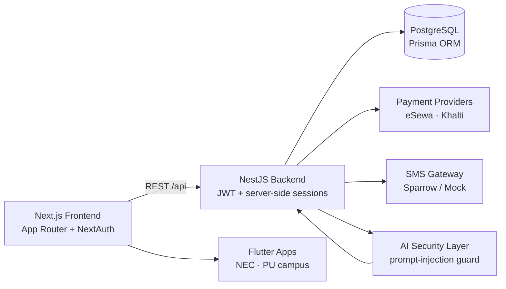

<!-- Profile README for sushant-me. Animated + honest. Edit freely. -->

  

  

  <b>Securing LLM pipelines · Architecting offline systems · Building for places where infrastructure doesn't</b>

  
  
  
  

---

### 👨‍💻 About me

- 🧠 **AI security & applied research** — prompt-injection defenses for multi-agent LLM pipelines; offline/edge AI systems.
- 🏗️ **Full-stack engineer** — architect and ship web + mobile products end-to-end (React/Next.js, Node, Flutter, Python).
- 🏆 **2x Hult Prize 1st Runner-Up** (2024 & 2025) · Aspire Leaders Global Finalist (Harvard Business School faculty).
- ⚔️ Hackathon veteran — CoESS Cybersecurity Hackathon (offensive security) · NEC Ingegium core architect.
- 🎓 Computer Engineering (final year) @ Nepal Engineering College (NEC).
- 📍 Kathmandu, Nepal — I build for places where connectivity is unreliable.

### 🛡️ Security track record (verifiable)

Real bugs, fixed in real projects — each one links to the evidence. Work still
in review is marked as such and linked, so the status is checkable rather than
asserted.

| What | Evidence |
|---|---|
| **5 memory-safety bugs** found & fixed in Google's S2 geometry library — null-deref, OOB read, two OOMs (16 GiB / 2.4 GiB), heap-buffer-overflow — ASan-verified | [google/s2geometry#675](https://github.com/google/s2geometry/pull/675) |
| **Security fix merged into Google's `go-github`** — a release-asset upload could be redirected by the API response, carrying the caller's `Authorization` header, to a host of the response's choosing; now refused unless it matches the configured upload host *(two maintainer approvals)* | [merged to master](https://github.com/google/go-github/commit/fe2bc5ce21a2339d9f9c69f994feefbc61b93fdb) · [PR #4556](https://github.com/google/go-github/pull/4556) |
| **Tool-boundary vulnerability** identified in `google-gemini/gemini-cli`'s agent CI — mechanism withheld pending vendor triage | found with [agentbound](https://github.com/sushant-me/agentbound) |
| **Google maintainer reproduced** a tool-shadowing bug I reported in the ADK MCP toolset — *"we have reproduced it on my end"*; the team is reviewing both fix PRs | [adk-python#7144](https://github.com/google/adk-python/issues/7144) · [PR #7145](https://github.com/google/adk-python/pull/7145) |
| **Java port of the same class reported** — in-model built-ins share a name with a server-supplied tool, and a server tool named `set_model_response` aborts the run | [adk-java#1513](https://github.com/google/adk-java/issues/1513) · [PR #1515](https://github.com/google/adk-java/pull/1515) |
| **PortSwigger Web Security Academy** — 100% of all 273 labs · **Expert** level · Hall of Fame **#237** | [Web Security Academy](https://portswigger.net/web-security) |
| **HackingHub** — reached **#1 on the leaderboard** · Security Precursor Path certified | [hackinghub.io](https://app.hackinghub.io/) |
| **Google VRP** — 4 reports submitted, 2 assigned by triage | (private disclosure) |
| **Attack vector contributed to Trail of Bits' `agentic-actions-auditor`** — the unbounded-tool-target class behind CVE-2026-44246, which its A–I vectors did not cover; also corrected its Vector H false-positive note, whose "specific restricted tool patterns are not dangerous" clearing also covered the mutating forms this class is made of | [trailofbits/skills#311](https://github.com/trailofbits/skills/pull/311) *(in review)* |
| **Detection rule contributed to `sisaku-security/sisakulint`, and the audit it forced** — `ai-action-unbounded-tool-pattern`, validated by running it over **224 real workflows** rather than my own fixtures, which then exposed bugs in **five shipped rules including its own**: a trigger set omitting two events the repo's own `PrivilegedTriggers` calls untrusted; a `"*"` allowlist matched only as a whole string; `openai/codex-action`'s `allow-users` input never read at all; the list shared by all six AI rules missing `claude-code-base-action`, leaving every rule blind to it; and a sandbox check guarding a value under an input it never read — which reported **nothing** until corrected, when it found **10**. Every fix carries a regression test that fails without it | [sisakulint#644](https://github.com/sisaku-security/sisakulint/pull/644) *(in review)* · [issue #645](https://github.com/sisaku-security/sisakulint/issues/645) |
| **Reproducible fixtures + measured detector coverage** for the agentic-workflow-injection class published as **CVE-2026-44246** (nnU-Net, CVSS 7.2) — three real revisions pinned by commit SHA, scored by three detectors, re-runnable byte-identically from a fresh clone | [agentic-workflow-injection](https://github.com/sushant-me/agentic-workflow-injection) |

**Open-source security tooling I built:**

- **[agentbound](https://github.com/sushant-me/agentbound)** — cross-language (Python / TypeScript / JavaScript / Go / Java / GitHub Actions) static detector for AI-agent tool-boundary bugs: reserved-name omission, last-wins tool dicts, fail-open confirmation gates, unauthenticated agent CI dispatch. It found the gemini-cli issue above, and it detects the published CVE-2026-44246 vector. Rule severity tracks what the agent may actually call rather than what the job's `permissions` block grants — the distinction that separates nnU-Net's two hardening commits, whose permissions blocks are identical. Released **[v0.1.9](https://github.com/sushant-me/agentbound/releases/tag/v0.1.9)**, and usable as a GitHub Action in three lines of YAML.
- **[mcp-nameguard](https://github.com/sushant-me/mcp-nameguard)** — checks the tool names an MCP server advertises against the names agent frameworks put on the wire themselves (cross-server tool shadowing). It reports two grades, because they are different facts: `GUARDED` names the framework refuses before the request reaches the model, and `UNGUARDED` names it owns and does not defend. The second is the more useful finding, and in the ADK ports the split is not where it first looks: Go and Java have no reserved-name list, yet a server still cannot take a name they pack, because `PackTool` and `appendTools` both refuse the duplicate. What stays open is the in-model built-ins (`google_search`, `url_context`), which append to `config.Tools` and bypass both checks. Grew out of a gap I found and reported in `google/adk-python` — [#7144](https://github.com/google/adk-python/issues/7144) / [#7145](https://github.com/google/adk-python/pull/7145); the Java guard is in review, and I withdrew the Go one after finding `PackTool` already fails closed. Released **[v0.4.7](https://github.com/sushant-me/mcp-nameguard/releases/tag/v0.4.7)**.
- **[trajectorycheck](https://github.com/sushant-me/trajectorycheck)** — trajectory-level evaluator for AI agents: scores tool selection, argument correctness, side effects and cross-run determinism, catching the "looks correct but is broken" failures output-level evals miss. Released **[v0.1.2](https://github.com/sushant-me/trajectorycheck/releases/tag/v0.1.2)**.
- **[agentic-workflow-injection](https://github.com/sushant-me/agentic-workflow-injection)** — reproducible vulnerable/fixed fixtures for agentic workflow injection, with detector coverage measured rather than asserted, and a mitigation guide that ranks the controls by whether each depends on the model choosing to comply. Released **[v1.0.0](https://github.com/sushant-me/agentic-workflow-injection/releases/tag/v1.0.0)**. Built because there was nothing to test a rule against. The mitigation guide is published at **[sushant-me.github.io/agentic-workflow-injection](https://sushant-me.github.io/agentic-workflow-injection/)**. The case study is the one nobody had written down: nnU-Net hardened CVE-2026-44246 in **two** commits, and the commit titled *"hardened issue and PR agents"* still left the agent able to comment — so a detector that treats before/after as a binary marks the middle revision fixed. It also shows "fixed in v2.4.1" is not checkable from the tag, which contains no agent workflow at all.

### 🚀 Featured work

| Project | What it is | Links |
|---|---|---|
| **Mero-Bazaar-Secured** | Nepali e-commerce marketplace hardened against **52 real security findings**, with a public post-remediation security report | [Repo](https://github.com/sushant-me/Mero-Bazaar-Secured) |
| **OfflinePay** | Payment flows that work fully offline, built for Nepal's connectivity reality | [Repo](https://github.com/sushant-me/offlinepay) |
| **Devanagari Vault** | Client-side AES vault with Devanagari obfuscation | [Repo](https://github.com/sushant-me/devanagari-vault) |
| **Patho Uber** | Dynamic ride-pricing for Nepal — fares by distance, vehicle type, and surge | [Repo](https://github.com/sushant-me/patho_uber) |
| **Campus apps** | NEC campus app + Pokhara University syllabus app used by real students | [NEC](https://github.com/sushant-me/nec-campus-app) · [PU](https://github.com/sushant-me/Pokhara-University-computer-app) |
| **Portfolio** | Personal site | [Repo](https://github.com/sushant-me/Portfolio) |

### 🧱 Architecture (Mermaid)

### 🧪 Research

**Edge-Native Semantic Firewall** — *can a 3.8B model on one laptop act as an autonomous agent's action-verification layer?*

I ran 1,800 generations on Phi-3-mini (4-bit, held inside a 4.2 GiB VRAM budget, no cloud calls) across 600 policy scenarios, comparing three ways of asking the model to judge a proposed action: free-form text, JSON-constrained output, and JSON with a mandated Chain-of-Thought field order.

The result inverted the assumption. **Constraining the output format without requiring the reasoning step produced the least safe evaluator of the three** — that arm approved 46.2% of the actions the policy would have blocked or escalated, worse than unconstrained free-form at 17.2%. Requiring the rule attribution first cut it to 23.5% and lifted hard-denial accuracy from 62.5% to **90.8%**.

It still approved **6 of 208 irreversible actions**, and it was *more permissive than free-form* on ambiguous cases that should have reached a human. So the paper concludes a model this size can serve as **one layer** of a defence-in-depth stack and not a sole control — and we withdrew three earlier claims, including a "100%" headline, that our own measurements falsified.

Every number is checkable: the corpus generator, the harness, all 3,000 recorded generations (1,800 across the three conditions, 600 with a declared action vector, 600 replication), and the paper are in the repo. Reproducing a negative result and publishing it is the part I'd point at.

→ **[Code · corpus · raw outputs · paper](https://github.com/sushant-me/Edge-Native_Semantic_Firewall_)**

Also in progress, **not yet public**: EmbodiedOS (offline robotic control with local LLMs) and GhostSignal (ESP32 Wi-Fi CSI sensing for locating movement under rubble). Kept off the list until there's an artifact worth linking.

### 💼 Experience

- 🧠 **AI Intern** — Eminence Ways (May 2026 – Aug 2026)
- ⚡ **Software Engineer Intern (Tech Lead)** — Avatar Tech Solutions (Dec 2025 – Jun 2026)
- 🌍 **Fundamentals Program Intern** — Nobel Learning PBC, USA (Dec 2025 – Aug 2026)
- 💻 **Freelance Full-Stack Developer** — Self-employed (Aug 2023 – Present)

### 🛠️ Tech stack (animated)

  

### 📊 Profile summary (colorful, live)

  
   
  
  

### 📈 Activity & contributions

  

  <picture>
    <source media="(prefers-color-scheme: dark)" srcset="https://raw.githubusercontent.com/sushant-me/sushant-me/output/github-contribution-grid-snake-dark.svg" />
    <source media="(prefers-color-scheme: light)" srcset="https://raw.githubusercontent.com/sushant-me/sushant-me/output/github-contribution-grid-snake.svg" />
    
  </picture>

### 🏅 Achievements & highlights

  
  
  
  

### 📬 Get in touch

- Email: [sushant.poudel2028@gmail.com](mailto:sushant.poudel2028@gmail.com)
- Open to internships, research collaborations, security consulting, and hackathon teams — if you work on AI safety, offline systems, or Nepal-focused tech, reach out.

