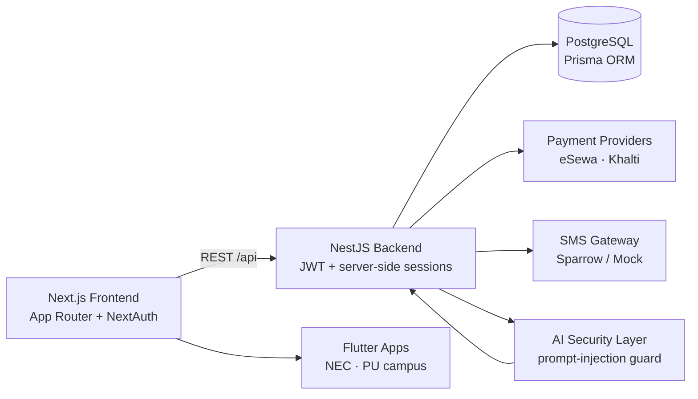

<!-- Profile README for sushant-me. Animated + honest. Edit freely. -->

  

  

  <b>Securing LLM pipelines · Architecting offline systems · Building for places where infrastructure doesn't</b>

  
  
  
  

---

### 👨‍💻 About me

- 🧠 **AI security & applied research** — prompt-injection defenses for multi-agent LLM pipelines; offline/edge AI systems.
- 🏗️ **Full-stack engineer** — architect and ship web + mobile products end-to-end (React/Next.js, Node, Flutter, Python).
- 🏆 **2x Hult Prize 1st Runner-Up** (2024 & 2025) · Aspire Leaders Global Finalist (Harvard Business School faculty).
- ⚔️ Hackathon veteran — CoESS Cybersecurity Hackathon (offensive security) · NEC Ingegium core architect.
- 🎓 Computer Engineering (final year) @ Nepal Engineering College (NEC).
- 📍 Kathmandu, Nepal — I build for places where connectivity is unreliable.

### 🛡️ Security track record (verifiable)

Real bugs, fixed in real projects — each one links to the evidence.

| What | Evidence |
|---|---|
| **5 memory-safety bugs** found & fixed in Google's S2 geometry library — null-deref, OOB read, two OOMs (16 GiB / 2.4 GiB), heap-buffer-overflow — ASan-verified | [google/s2geometry#675](https://github.com/google/s2geometry/pull/675) |
| **Google maintainer LGTM** on a security fix to `go-github` | [google/go-github#4556](https://github.com/google/go-github/pull/4556) |
| **Tool-boundary vulnerability** found in `google-gemini/gemini-cli` — unauthenticated `issues` event triggering a credential-bearing agent | via [agentbound](https://github.com/sushant-me/agentbound) |
| **Google engineer reproduced** a tool-shadowing bug I reported in the ADK MCP toolset — *"I have successfully reproduced the issue you described"*; issue and fix PR both under team review | [issue](https://github.com/google/adk-java/issues/1513) · [PR](https://github.com/google/adk-java/pull/1515) · [Go port](https://github.com/google/adk-go/pull/1606) |
| **PortSwigger Web Security Academy** — 100% of all 273 labs · **Expert** level · Hall of Fame **#237** | [Web Security Academy](https://portswigger.net/web-security) |
| **HackingHub** — **#1 on the leaderboard** (current quarter) · Security Precursor Path certified | [hackinghub.io](https://app.hackinghub.io/) |
| **Google VRP** — 4 reports submitted, 2 assigned by triage | (private disclosure) |

**Open-source security tooling I built:**

- **[agentbound](https://github.com/sushant-me/agentbound)** — cross-language (Python / TypeScript / JavaScript / Go / Java / GitHub Actions) static detector for AI-agent tool-boundary bugs: reserved-name omission, last-wins tool dicts, fail-open confirmation gates, unauthenticated agent CI dispatch. It found the gemini-cli issue above.
- **[trajectorycheck](https://github.com/sushant-me/trajectorycheck)** — trajectory-level evaluator for AI agents: scores tool selection, argument correctness, side effects and cross-run determinism, catching the "looks correct but is broken" failures output-level evals miss.

### 🚀 Featured work

| Project | What it is | Links |
|---|---|---|
| **Mero-Bazaar-Secured** | Nepali e-commerce marketplace hardened against **52 real security findings**, with a public post-remediation security report | [Repo](https://github.com/sushant-me/Mero-Bazaar-Secured) |
| **OfflinePay** | Payment flows that work fully offline, built for Nepal's connectivity reality | [Repo](https://github.com/sushant-me/offlinepay) |
| **Devanagari Vault** | Client-side AES vault with Devanagari obfuscation | [Repo](https://github.com/sushant-me/devanagari-vault) |
| **Patho Uber** | Dynamic ride-pricing for Nepal — fares by distance, vehicle type, and surge | [Repo](https://github.com/sushant-me/patho_uber) |
| **Campus apps** | NEC campus app + Pokhara University syllabus app used by real students | [NEC](https://github.com/sushant-me/nec-campus-app) · [PU](https://github.com/sushant-me/Pokhara-University-computer-app) |
| **Portfolio** | Personal site | [Repo](https://github.com/sushant-me/Portfolio) |

### 🧱 Architecture (Mermaid)

### 🧪 Research & signature projects

| Project | Area | Status |
|---|---|---|
| LLM Agent Firewall | AI security | Sub-millisecond offline inspection layer for multi-agent pipelines (100% overt prompt-injection containment). Submitted to Cyber-AI 2026. |
| EmbodiedOS | Edge AI | Fully offline robotic OS — C++ hardware control with local LLMs for manipulation. |
| GhostSignal | Wi-Fi sensing | ESP32 Wi-Fi CSI rescue system detecting micro-movements under rubble. |

### 💼 Experience

- 🧠 **AI Intern** — Eminence Ways (May 2026 – Aug 2026)
- ⚡ **Software Engineer Intern (Tech Lead)** — Avatar Tech Solutions (Dec 2025 – Jun 2026)
- 🌍 **Fundamentals Program Intern** — Nobel Learning PBC, USA (Dec 2025 – Aug 2026)
- 💻 **Freelance Full-Stack Developer** — Self-employed (Aug 2023 – Present)

### 🛠️ Tech stack (animated)

  

### 📊 Profile summary (colorful, live)

  
   
  
  

### 📈 Activity & contributions

  

  <picture>
    <source media="(prefers-color-scheme: dark)" srcset="https://raw.githubusercontent.com/sushant-me/sushant-me/output/github-contribution-grid-snake-dark.svg" />
    <source media="(prefers-color-scheme: light)" srcset="https://raw.githubusercontent.com/sushant-me/sushant-me/output/github-contribution-grid-snake.svg" />
    
  </picture>

### 🏅 Achievements & highlights

  
  
  
  

### 📬 Get in touch

- Email: [sushant.poudel2028@gmail.com](mailto:sushant.poudel2028@gmail.com)
- Open to internships, research collaborations, security consulting, and hackathon teams — if you work on AI safety, offline systems, or Nepal-focused tech, reach out.
